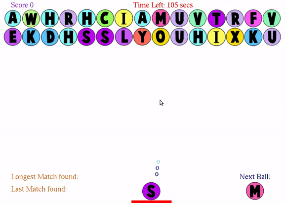

# Word Shooter

A simple bubble shooter type game made with **C++** and **OpenGL**. This game was made for the semester project of course _Introduction to Computing (ITC)_.

The objective of this project was to test programming skills (in C++) taught in the course.

Words provided in the file **words_alpha.txt** are used to match the words formed by combination of letters in horizontal, vertical or diagonal direction.

**Project Guidelines:** [pdf](assets/instructions.pdf)

 

Gameplay <strong>(GIF - 10 seconds)</strong>

    

